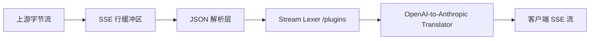

# Protoflux 架构设计 (Production Grade)

## 1. 目标

构建一个高性能、生产级的协议转换网关：

- **客户端侧**：深度兼容 OpenAI 与 Anthropic (Claude) 协议，支持 Claude Code 等复杂工具调用流。
- **上游侧**：适配 OpenAI, Aliyun DashScope, 以及 AWS Bedrock (支持 Cross-Protocol Streaming)。
- **核心价值**：协议转译 + 流式稳定性保障 + 工具命名自动化治理。

## 2. 核心流水线 (Streaming Pipeline)

Protoflux 的核心竞争力在于其「零延迟、高稳定性」的流式处理链路：

### 关键组件说明：
- **SSE Line Buffer**: 解决 TCP 拆包导致的 JSON 截断。确保每一行 `data: {...}` 在解析前都是完整的。
- **Stream Lexer (XML)**: 采用状态机实时分析文本。能够从中剥离出 `<thought>` 块和 `<tool_call>` 块，而不引入首包延迟。
- **Translator**: 负责状态维护（如 Block Index）和协议字段的精准映射（如将 OpenAI 的 `finish_reason` 转换为 Anthropic 风格的停止事件）。

## 3. 确定性工具映射系统 (Deterministic Tool Mapping)

为了兼容 Claude Code 发出的高度复杂的 MCP 工具名（如 `mcp__acp__Read`），Protoflux 实现了双工映射注册表：

1. **入站阶段 (Inbound)**:
   - 解析客户端请求中的 `tools` 列表。
   - 提取工具基名（Simplified Name，如 `Read`），并记录映射关系：`Read` -> `mcp__acp__Read`。
   - 将简化后的工具列表传给模型，显著提升模型遵循指令的能力。
   
2. **出站阶段 (Outbound)**:
   - 当模型返回 `tool_use(name="Read")` 时。
   - 转译层查阅该请求对应的注册表。
   - 将 `Read` 自动还原为 `mcp__acp__Read` 返还给客户端。

## 4. 自动 Schema 对齐 (Schema Alignment)

网关会自动感知上游协议要求：
- 如果上游是 **GLM-5** 或标准 **OpenAI** 接口，网关会将 Anthropic 的 `input_schema` 实时转换为 OpenAI 的 `type: "function"` 嵌套结构。
- 这种转换对客户端是完全透明的。

## 5. 流式成熟度状态 (Streaming Roadmap Status)

项目已进入 **Streaming V3 (Stable)** 阶段：

- **[x] V1 (Text)**: 文本增量转发与基础协议头映射。
- **[x] V2 (Tooling)**: 支持原生 OpenAI Tool Calls 与 XML 工具调用提取。
- **[x] V3 (Stability)**: 引入 SSE Line Buffer，支持 Reasoning Block (Thought) 转发，解决 Bedrock 断流问题。

## 6. 后续规划

- **可观测性**: 引入首 token 时延 (TTFB) 与流完整性监控。
- **治理能力**: 针对不同模型实施不同的采样与安全过滤策略插件。
- **性能**: 探索在 Bun 环境下使用 `Uint8Array` 直接操作实现更高效的零拷贝转译。
